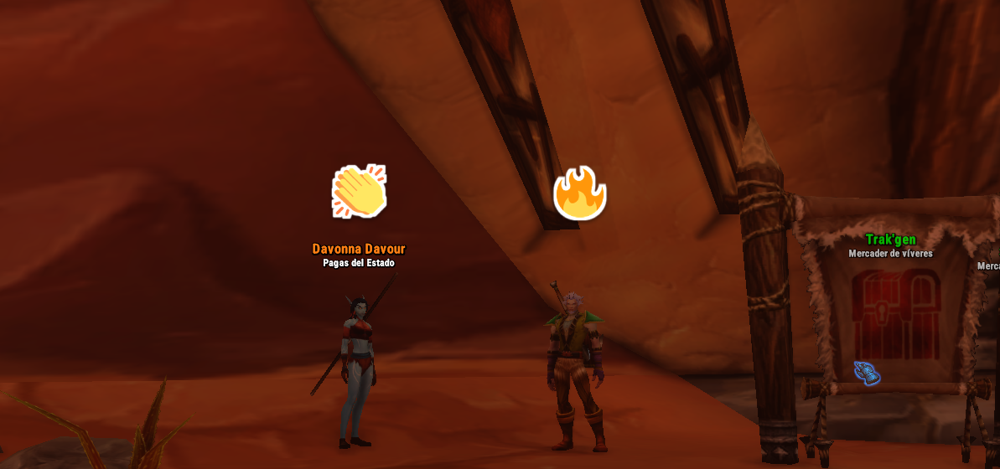
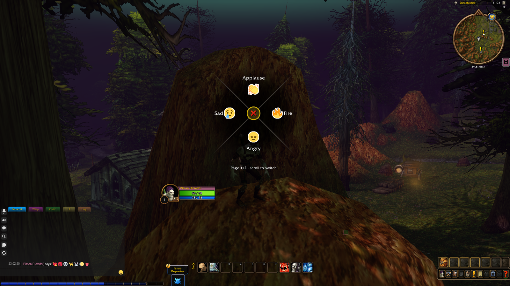
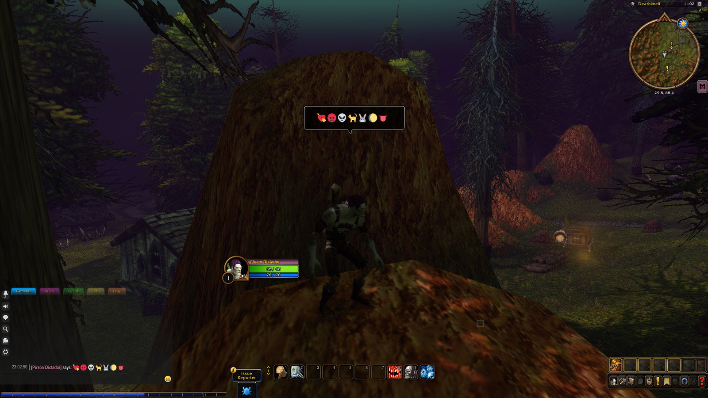
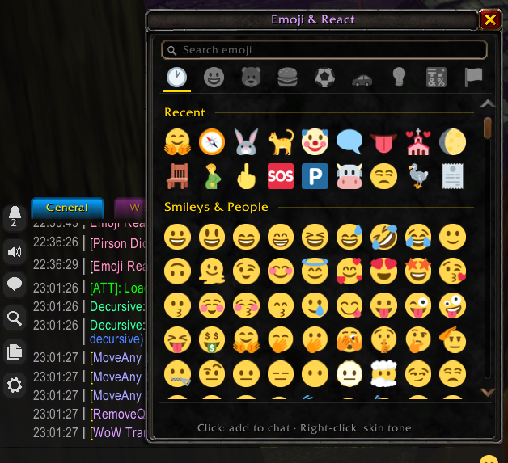
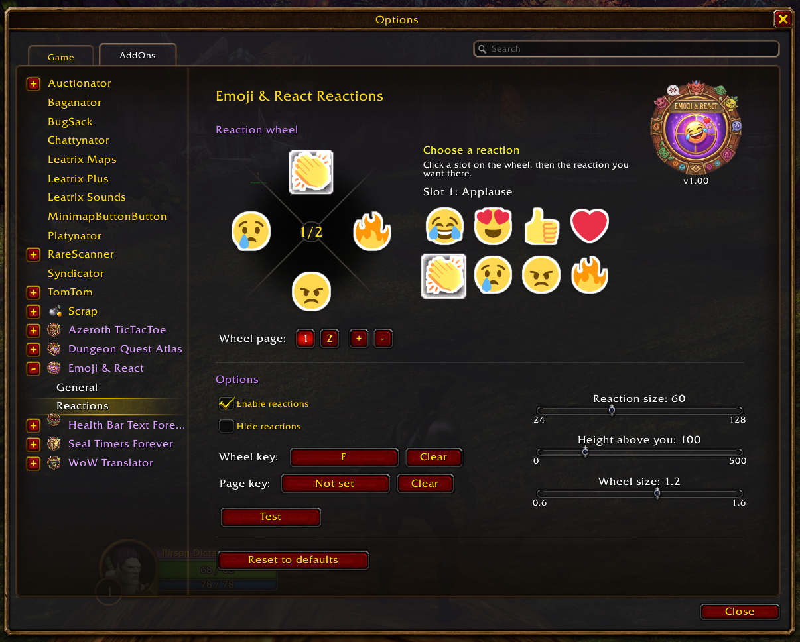
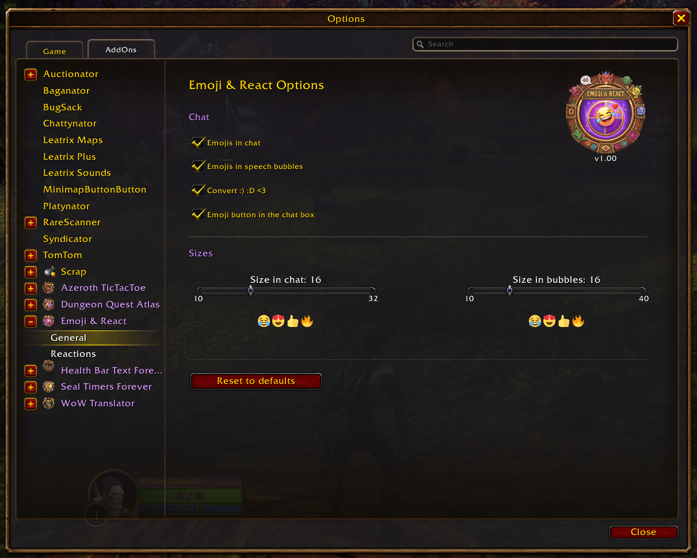

<h1 align="center">Emoji & React</h1>

  <b>Emojis in chat and speech bubbles, plus a reaction wheel for World of Warcraft: Forever</b>

<a href="README.es.md">🇪🇸 Español</a>

---

## What it does

**Emoji & React** brings the emojis you use every day to WoW Forever's chat and speech bubbles, and adds a **reaction wheel**: hold a key, point the mouse towards a reaction, release, and it pops up above your character for nearby players who also have the addon.

| You type | You see |
|---|---|
| `:joy:` `:heart_eyes:` `:thumbsup:` | the emoji, in chat and in the bubble |
| `:)` `:D` `<3` `xD` | the matching emoji |
| a pasted emoji (Win + .) | the emoji instead of a blank box |

| | |
|---|---|
|  |  |
|  |  |
|  |  |

## Features

- **Every emoji** (1,900 plus skin tones) in chat and in /say, /yell and party speech bubbles, written as `:joy:` (Discord/Slack codes) or pasted.
- **WhatsApp-style emoji panel** from a button inside the chat box: search in your language, categories, recently used and skin tones (right-click an emoji).
- **Reactions with their own images**, separate from the chat emojis, including PvP ones (**GG, WP, EZ, 1V1, RIP, LOL**). They pop in like Fortnite emojis: bounce in, wobble and burst away.
- Classic emoticons (`:)`, `:D`, `<3`...) converted too, without touching links or URLs.
- Reaction wheel that looks and works like the game's own **Ping Wheel**: hold **the key you choose** (keyboard, combination or mouse button), point the mouse towards a reaction and release; release on the center X to cancel. Pages of 4 reactions (one per 4 reaction images), switched with the mouse wheel or a key of your choice, all of them chosen by you.
- Settings live in the game's own **Options → AddOns** panel: sizes, what to convert, the wheel key, the wheel reactions and the height of your own reaction.
- Lightweight, no libraries.

## Installation

1. Download the zip from [CurseForge](https://www.curseforge.com/wow/addons/emoji-react) or the [latest release](https://github.com/Pirson-s-Addons/EmojiReact/releases/latest).
2. Extract the `EmojiReact` folder into `World of Warcraft/_classic_beta_/Interface/AddOns/`.
3. Restart WoW and enable the addon.

## Usage

- `/emoji` opens the settings. `/emoji wheel` opens the reactions panel. `/emoji panel` opens the emoji panel (also from the button in the chat box or its key binding). `/emoji key` chooses the wheel key. `/emoji test` shows a reaction above you.
- **Options → AddOns → Emoji & React → General**: chat and bubbles.
- **Options → AddOns → Emoji & React → Reactions**: the wheel as it looks in game. Click a slot and pick its reaction, add or remove pages, and set the key, sizes and height.
- **Other players'** reactions appear above their nameplate. If you don't use friendly nameplates, the addon turns them on only while the reaction lasts and puts them back as they were. *Hide reactions* hides other players' reactions, and then the addon never touches nameplates.

## Notes

- Messages are still sent as text (`:joy:`): players without the addon see the text, as with any emoji addon.
- **Inside dungeons and raids** Blizzard does not let addons read chat or touch speech bubbles and friendly nameplates: there are no emojis in chat or bubbles, and your group's reactions show next to their party frame instead of above them.
- Your own character has no nameplate, so your reaction is placed above the screen center. Adjust *Height above you* to your camera zoom.

---

**Author**: Pirson · [GitHub](https://github.com/Pirson-s-Addons) · [CurseForge](https://www.curseforge.com/members/pirson/projects) · MIT License · Emoji graphics: [Twemoji](https://github.com/jdecked/twemoji) (CC-BY 4.0) · Emoji data: [emojibase](https://emojibase.dev) (MIT)
